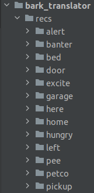

# bark_translator
From this video:
https://www.youtube.com/watch?v=GY33kZbClow

## Inspiration
Based on https://github.com/russinnes/py-vox-recorder/blob/master/py-corder-osx.py

## Dependencies and Setup
`apt-get install python3-pyaudio python3-numpy libasound2-dev`

Also, there are some pip dependencies, but I forgot to pip freeze them lawl.

You will also need to create directories like this:



Inside these directories, you need to record short .wav files for each response you want it to say.
The responses are then configurable by time of day in the `speak.py` file.


## Running

The device needs to be able to start the scripts by itself.  
In order to do that, add the following two lines to the end of `/etc/rc.local`  
```
sudo python3 /home/pi/git/bark_translator/voice.py &
exit 0
```
